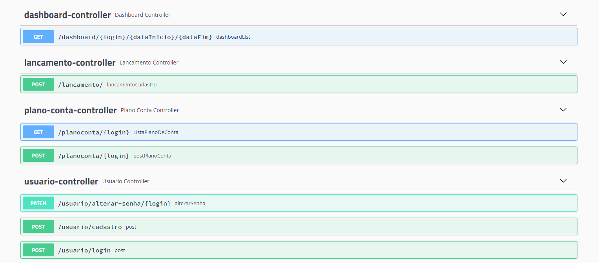
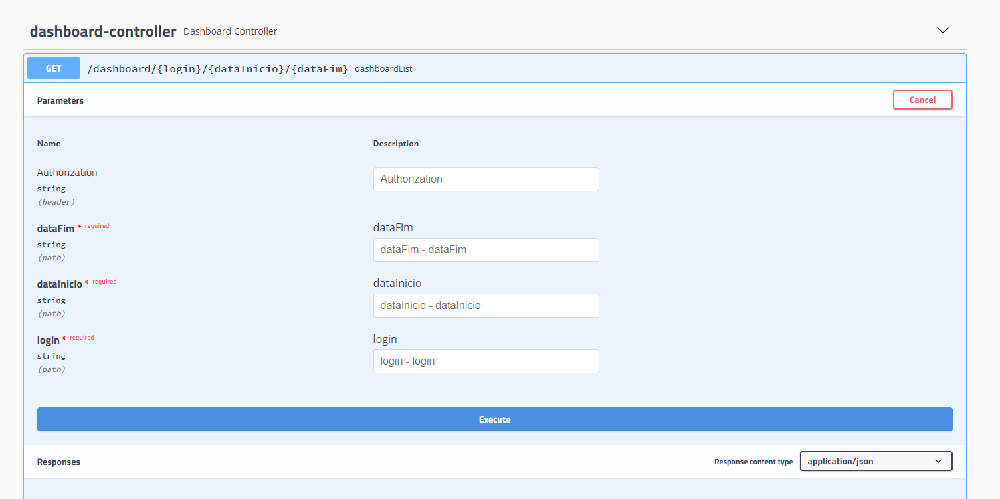
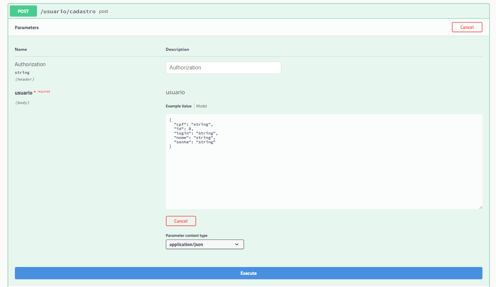
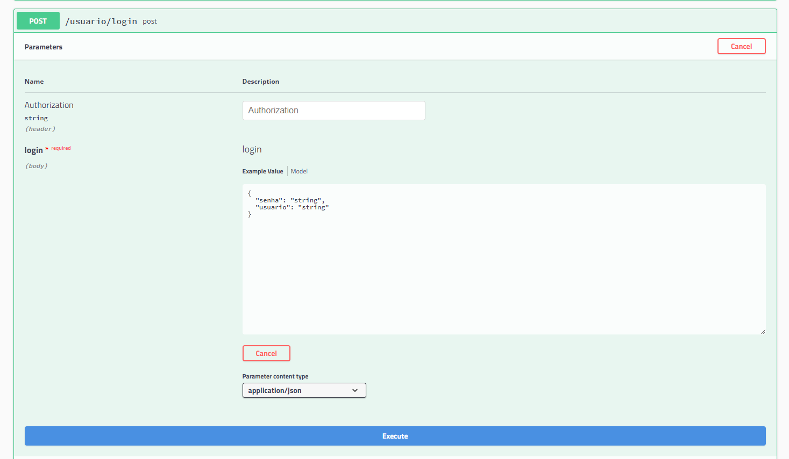
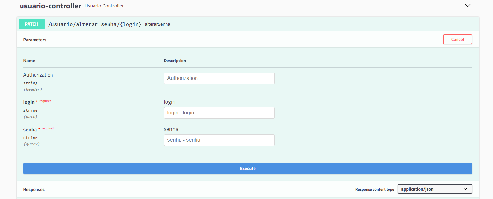
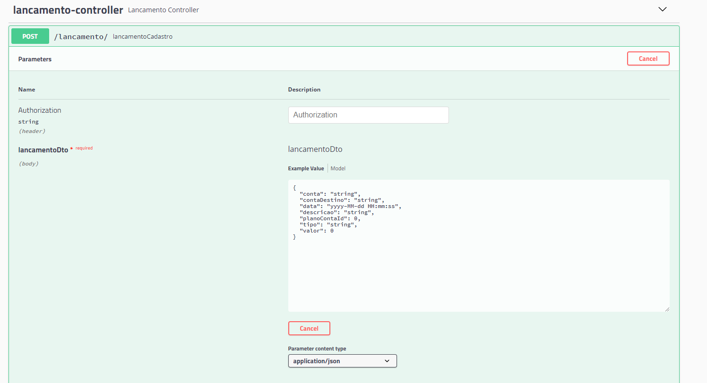
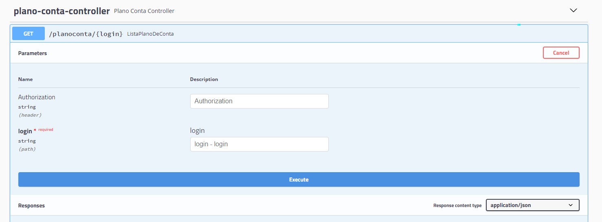

<h1 align="center">  Projeto Bankline - API em Java </h1> 
<p align="center"> Projeto final do bootcamp da Gama Academy - Turma 7 </p>
<h4 align="center"> 
	
</h4>

## Time Undefined

<table align="center">
  <tr>
    <td align="center"><a href="https://github.com/edbbarros"><br /><sub><b>Eduardo Barros</b></sub></a><br /><a href="https://github.com/edbbarros" title="Undefined">:octocat:</a></td>
    <td align="center"><a href="https://github.com/felipeks"><br /><sub><b>Felipe Seabra de Andrade</b></sub></a><br /><a href="https://github.com/felipeks" title="Undefined">:octocat:</a></td>
    <td align="center"><a href="https://github.com/GuiMM"><br /><sub><b>Guilherme Macedo Moreira</b></sub></a><br /><a href="https://github.com/GuiMM" title="Undefined">:octocat:</a></td>
    <td align="center"><a href="https://github.com/luccasgo"><br /><sub><b>Luccas Gomes Maciel</b></sub></a><br /><a href="https://github.com/luccasgo" title="Undefined">:octocat:</a></td>
    <td align="center"><a href="https://github.com/milenynakahara"><br /><sub><b>Mileny Nakahara</b></sub></a><br /><a href="https://github.com/milenynakahara" title="Undefined">:octocat:</a></td>
 </tr>
</table>


- Eduardo Barros 
  - Nível iniciante
  - Responsável por: auxílio na definição da regra de negócio 
- Felipe Seabra :
  - Nível intermediário: 
  - Responsável por:  regra de negócio (service),  modelagem do banco de dados (repository), utilitários (utils) e controller.
- Guilherme Macedo Moreira 
  - Nível intermediário:
  - Responsável por:  desenvolver o modelo (model), regra de negócio (service),  modelagem do banco de dados (repository) , exceções (exception) e controller.
- Luccas Maciel:
  - Nível intermediário:
  - Responsável por: auxiliou na configuração. 
- Mileny Nakahara :
  - Nível iniciante.
  - Área de atuação: Github (Readme, merges, arrumar conflitos e manter a branch do project-spring atualizada), parte do desenvolvimento do service,  configurações e suporte nas definições de regra de negócios. 

## Funcionalidades da API
### API de um Bankline com cadastro de usuário, contas e lançamentos.
### Usuário
- Cadastrar
- Alterar senha 

### Transações bancárias
- Pagamento
- Depósito
- Transferência
- Lista

## Estrutura do Projeto
- Separado dentro de um path 📂src/main/java em pacotes, cada um com suas responsabilidades: 
- Model: modelo do banco de dados  
- Repository: a interface do banco de dados
- Service: regras de negócios
- Dto:  Objeto com propriedades de classe mais convenientes para manipulação em certos contextos. 
- Controller: definições do REST para entrada e saída de dados
- Enums: valores pré definidos e usadas no desenvolvimento da API
- Doc: configurações do Swagger para documentação da API
- Config: configurações do Gson

```
📂src/main/java
 ┃ ┃ ┃ ┗  📂com
 ┃ ┃ ┃ ┃ ┗ 📦com.bankline
 ┃ ┃ ┃ ┃ ┃ ┗ 📦config
 ┃ ┃ ┃ ┃ ┃ ┃ ┗ 📜Beans.java
 ┃ ┃ ┃ ┃ ┃ ┣ 📦controlle
 ┃ ┃ ┃ ┃ ┃ ┃ ┗ 📜DashboardController.java
 ┃ ┃ ┃ ┃ ┃ ┃ ┗ 📜LancamentoController.java
 ┃ ┃ ┃ ┃ ┃ ┃ ┗ 📜UsuarioController.java
 ┃ ┃ ┃ ┃ ┃ ┃ ┗ 📜PlanoContaController.java
 ┃ ┃ ┃ ┃ ┃ ┣ 📦doc
 ┃ ┃ ┃ ┃ ┃ ┃ ┗ 📜SwaggerConfig.java
 ┃ ┃ ┃ ┃ ┃ ┣ 📦dto
 ┃ ┃ ┃ ┃ ┃ ┃ ┣ 📜ContaDto.java
 ┃ ┃ ┃ ┃ ┃ ┃ ┣ 📜DashboardRequestDto.java
 ┃ ┃ ┃ ┃ ┃ ┃ ┣ 📜DashboardResultDto.java
 ┃ ┃ ┃ ┃ ┃ ┃ ┣ 📜DashboardResultDto.java
 ┃ ┃ ┃ ┃ ┃ ┃ ┣ 📜LoginDto.java
 ┃ ┃ ┃ ┃ ┃ ┃ ┣ 📜PlanoContaDto.java 
 ┃ ┃ ┃ ┃ ┃ ┃ ┣ 📜Sessao.java 
 ┃ ┃ ┃ ┃ ┃ ┃ ┗ 📜UsuarioDto.java
 ┃ ┃ ┃ ┃ ┃ ┣ 📦exception
 ┃ ┃ ┃ ┃ ┃ ┃ ┗📜BusinessException.java
 ┃ ┃ ┃ ┃ ┃ ┣ 📦model
 ┃ ┃ ┃ ┃ ┃ ┃ ┣ 📦enum
 ┃ ┃ ┃ ┃ ┃ ┃ ┃ ┣ 📜ContaTipoEnum.java
 ┃ ┃ ┃ ┃ ┃ ┃ ┃ ┗ 📜TipoMovimentoEnum.java
 ┃ ┃ ┃ ┃ ┃ ┃ ┣ 📜Conta.java
 ┃ ┃ ┃ ┃ ┃ ┃ ┣ 📜Lancamento.java
 ┃ ┃ ┃ ┃ ┃ ┃ ┣ 📜Log.java 
 ┃ ┃ ┃ ┃ ┃ ┃ ┣ 📜PlanoConta.java
 ┃ ┃ ┃ ┃ ┃ ┃ ┗ 📜Usuario.java
 ┃ ┃ ┃ ┃ ┃ ┣ 📦repository
 ┃ ┃ ┃ ┃ ┃ ┃ ┣ 📜ContaRepository.java
 ┃ ┃ ┃ ┃ ┃ ┃ ┣ 📜LancamentoRepository.java
 ┃ ┃ ┃ ┃ ┃ ┃ ┣ 📜PlanoContaRepository.java
 ┃ ┃ ┃ ┃ ┃ ┃ ┗ 📜UsuarioRepository.java
 ┃ ┃ ┃ ┃ ┃ ┣ 📦security
 ┃ ┃ ┃ ┃ ┃ ┃ ┣ 📦jwt
 ┃ ┃ ┃ ┃ ┃ ┃ ┃ ┣ 📜JWTAuthorizationFilter.java
 ┃ ┃ ┃ ┃ ┃ ┃ ┃ ┗ 📜JWTConstants.java
 ┃ ┃ ┃ ┃ ┃ ┃ ┣ 📜AppUserDetailService.java
 ┃ ┃ ┃ ┃ ┃ ┃ ┗ 📜WebSecurityConfig.java
 ┃ ┃ ┃ ┃ ┃ ┣ 📦service
 ┃ ┃ ┃ ┃ ┃ ┃ ┣ 📜DashboardService.java
 ┃ ┃ ┃ ┃ ┃ ┃ ┣ 📜LancamentoService.java
 ┃ ┃ ┃ ┃ ┃ ┃ ┣ 📜PlanoContaService.java
 ┃ ┃ ┃ ┃ ┃ ┃ ┗ 📜UsuarioService.java
 ┃ ┃ ┃ ┃ ┃ ┣ 📦utils
 ┃ ┃ ┃ ┃ ┃ ┗ ┗ 📜CpfUtils.java
 📂src/main/resources
 ┃ ┃ ┃ ┃ ┗ 📦application.properties
 📂src/test/java
 ┃ ┃ ┃ ┗ 📂com
 ┃ ┃ ┃ ┃ ┗ 📦example.tdd
 ┃ ┃ ┃ ┃ ┃ ┃ ┣ 📜DemoApplicationTests.java
 ┃ ┃ ┃ ┃ ┃ ┃ ┣ 📜LancamentoServiceTest.java
 ┃ ┃ ┃ ┃ ┃ ┃ ┣ 📜TestBeans.java
 ┃ ┃ ┃ ┃ ┃ ┃ ┗ 📜UsuarioControllerTest.java
 ```

## Documentação - Swagger


## Dashboard
- Histórico de lançamento
  - detalhes da conta: débito, crédito, transferência entre usuários
  - Faz pesquisa de data de início e data final
- Saldo da conta

 
## Usuário
- Prés- requisitos de validação solicitada pelo cliente: 
  - Nome, cpf, login e senha: não podem ser nulos.
  - Login: limite de 20 caracteres e login duplicado não permitido.
  - CPF: limite de 11 caracteres e CPF duplicado não permitido.
  - Cadastro de novo usuário: cadastro de conta corrente e 3 planos de conta (as categorias “C” significa crédito, “D” de débito, “TU” de transferências entre usuários). 

- O model tem os atributos com métodos de Getter e Setter:
  - Id
  - Nome 
  - CPF
  - Login
  - Senha
  
### Cadastros de Usuários
  
### Login
  
### Alterar Senha
  

## Conta
- O model tem os atributos com o getters, setters e construtor:
  - Id - chave primária
  - Login 
  - Tipo (TipoConta Enum)
  - Saldo - sempre criado com saldo 0
  - Id Usuário

# TipoConta Enum
  - CORRENTE

## Lançamento
- O model tem os atributos com o Getters e Setters:
  - Id
  - Data
  - Valor
  - Descrição
  - Plano Conta
  - Conta
  - Conta de destino 
 
- O service faz as validações para criação do lançamento com as regras de negócio nos seguintes métodos:
  -registroEntrada, faz a validação conforme o tipo do plano de contas passado: “D”, “R” e “TU” (transferências entre usuário).
  -“D” executa a função de débito, subtraindo o saldo inicial
  -“C” executa a função de crédito, soma o saldo inicial
  -“TU” executa a função de transferência entre usuário. subtraindo da conta e somado na conta destino  
 
 
## TipoMovimentoEnum
  - R
  - D
  - TU
 
## Plano Conta (Categoria)
- O model tem os atributos com o getter, setters e construtor:
  - Id
  - nome - são as descrições do TipoMovimentoEnum
  - usuário
  - padrão - verifica se são TipoMovimentoEnum (bolean) que não podem ser alteradas. 
  - tipo movimento são TipoMovimentoEnum
      
     
- SPRING BOOT
  - Usamos o Spring Boot  que é baseado no framework Spring para facilitar no desenvolvimento da API brankline do projeto final do curso de Java.
  
  ## Versão Utilizada:
 - Java: 11
 - Maven: 4.0.0
 - Json Web Token: 0.7.0
 - Junit: 4
 - Banco de dados:
    - MySQL: 4.0.0
 - Swagger: 0.7.0

## Referências:
- Layout do README - Link de outra turma de java, compartilhada em aula pelo professor Gleyson: 
  - https://github.com/Team-Multiplayer/account-api/blob/master/README.md
- Layout do README 
  - https://blog.rocketseat.com.br/como-fazer-um-bom-readme/#-logo-ou-banner

