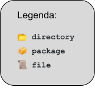

<html><head><meta content="text/html; charset=UTF-8" http-equiv="content-type"></head><body class="c33"><h1 class="c40" id="h.pdgrf4zhxh1a">Projeto Java API - Grupo Undefined </h1>
Esse projeto &eacute; o desafio final do curso de Java na Gama Academy, turma 7. O desafio &eacute; construir uma API que simule o funcionamento back-end de uma aplica&ccedil;&atilde;o de banco.

A vers&atilde;o atual &eacute; a 1.0 da API Bankline &nbsp;para cadastro de usu&aacute;rio, contas e lan&ccedil;amentos. A documenta&ccedil;&atilde;o da API pode ser acessada em _______(LINK HEROKU)_________
<h2 class="c14" id="h.ctry5ztheljm">Time Undefined</h2>
Boa parte do desenvolvimento foi feita em equipe, mas separamos responsabilidades para que cada um pudesse contribuir de acordo com seu n&iacute;vel. 
<ul class="c1 lst-kix_fegx7pj58jbi-0 start"><li class="c7 li-bullet-0"><a class="c16" href="https://www.google.com/url?q=https://github.com/edbbarros&amp;sa=D&amp;source=editors&amp;ust=1616385017147000&amp;usg=AOvVaw3TPUr_EBXPcM2XN8DpzUAx">Eduardo Barros</a>&nbsp;</li></ul><ul class="c1 lst-kix_fegx7pj58jbi-1 start"><li class="c21 li-bullet-0">N&iacute;vel iniciante</li><li class="c21 li-bullet-0">Respons&aacute;vel por: aux&iacute;lio na defini&ccedil;&atilde;o da regra de neg&oacute;cio </li></ul><ul class="c1 lst-kix_fegx7pj58jbi-0"><li class="c7 li-bullet-0"><a class="c16" href="https://www.google.com/url?q=https://github.com/felipeks&amp;sa=D&amp;source=editors&amp;ust=1616385017147000&amp;usg=AOvVaw2NdlLz7sP0cQ4z0MbcrY_v">Felipe Seabra</a>&nbsp;:</li></ul><ul class="c1 lst-kix_fegx7pj58jbi-1 start"><li class="c21 li-bullet-0">N&iacute;vel intermedi&aacute;rio: </li><li class="c21 li-bullet-0">Respons&aacute;vel por: &nbsp;regra de neg&oacute;cio (service), &nbsp;modelagem do banco de dados (repository), utilit&aacute;rios (utils) e controller.</li></ul><ul class="c1 lst-kix_fegx7pj58jbi-0"><li class="c7 li-bullet-0"><a class="c16" href="https://www.google.com/url?q=https://github.com/GuiMM&amp;sa=D&amp;source=editors&amp;ust=1616385017148000&amp;usg=AOvVaw2v37KlAkYnKNvKqtzWjYyi">Guilherme Macedo Moreira</a>&nbsp;</li></ul><ul class="c1 lst-kix_fegx7pj58jbi-1 start"><li class="c21 li-bullet-0">N&iacute;vel intermedi&aacute;rio:</li><li class="c21 li-bullet-0">Respons&aacute;vel por: &nbsp;desenvolver o modelo (model), regra de neg&oacute;cio (service), &nbsp;modelagem do banco de dados (repository) , exce&ccedil;&otilde;es (exception) e controller.</li></ul><ul class="c1 lst-kix_fegx7pj58jbi-0"><li class="c7 li-bullet-0"><a class="c16" href="https://www.google.com/url?q=https://github.com/luccasgo&amp;sa=D&amp;source=editors&amp;ust=1616385017148000&amp;usg=AOvVaw2siP7p361RyqNQ9uuhXR7m">Luccas Maciel</a>:</li></ul><ul class="c1 lst-kix_fegx7pj58jbi-1 start"><li class="c21 li-bullet-0">N&iacute;vel intermedi&aacute;rio:</li><li class="c21 li-bullet-0">Respons&aacute;vel por: auxiliou na configura&ccedil;&atilde;o. </li></ul><ul class="c1 lst-kix_fegx7pj58jbi-0"><li class="c7 li-bullet-0"><a class="c16" href="https://www.google.com/url?q=https://github.com/milenynakahara&amp;sa=D&amp;source=editors&amp;ust=1616385017148000&amp;usg=AOvVaw1gQ8HfarDdX0evImR_e1RY">Mileny Nakahara</a>&nbsp;:</li></ul><ul class="c1 lst-kix_fegx7pj58jbi-1 start"><li class="c21 li-bullet-0">N&iacute;vel iniciante.</li><li class="c21 li-bullet-0">&Aacute;rea de atua&ccedil;&atilde;o: Github (Readme, merges, arrumar conflitos e manter a branch do project-spring atualizada), parte do desenvolvimento do service, &nbsp;configura&ccedil;&otilde;es e suporte nas defini&ccedil;&otilde;es de regra de neg&oacute;cios. </li></ul><h2 class="c28" id="h.fgweqztf43d6">Funcionalidades da API</h2><ol class="c1 lst-kix_9z3fivtvhadu-0 start" start="1"><li class="c15 li-bullet-0"><h2 id="h.kcmcwoojt9t7" style="display:inline">Usu&aacute;rio</h2></li></ol><ol class="c1 lst-kix_9z3fivtvhadu-1 start" start="1"><li class="c22 li-bullet-0"><h2 id="h.5n0xyduchkh8" style="display:inline">Cadastrar</h2></li><li class="c22 li-bullet-0"><h2 id="h.h3nqd4agemp4" style="display:inline">Alterar senha </h2></li></ol><ol class="c1 lst-kix_9z3fivtvhadu-0" start="2"><li class="c15 li-bullet-0"><h2 id="h.pxhb9qgaqsvl" style="display:inline">Transa&ccedil;&otilde;es banc&aacute;rias</h2></li></ol><ol class="c1 lst-kix_9z3fivtvhadu-1 start" start="1"><li class="c22 li-bullet-0"><h2 id="h.t9xnwm29lifq" style="display:inline">Pagamento</h2></li><li class="c22 li-bullet-0"><h2 id="h.bwkk8z1u95qv" style="display:inline">Dep&oacute;sito</h2></li><li class="c22 li-bullet-0"><h2 id="h.2gzq5gg2aap8" style="display:inline">Transfer&ecirc;ncia</h2></li><li class="c22 li-bullet-0"><h2 id="h.xxdd2r9m770g" style="display:inline">Lista</h2></li><li class="c22 li-bullet-0"><h2 id="h.6bgdyhaug9kw" style="display:inline">Soma e subtra&ccedil;&atilde;o do saldo</h2></li></ol><h2 class="c14" id="h.4qin36wcxtvz">Estrutura do Projeto</h2>
Separado dentro de um path &#x1f4c2;src/main/java em pacotes, cada um com suas responsabilidades:&nbsp;
<ul class="c1 lst-kix_me7mxy1igsar-0 start"><li class="c2 li-bullet-0">Model: modelo do banco de dados &nbsp;</li><li class="c2 li-bullet-0">Repository: a interface do banco de dados</li><li class="c7 li-bullet-0">Service: regras de neg&oacute;cios</li><li class="c7 li-bullet-0">Dto: &nbsp;Objeto com propriedades de classe mais convenientes para manipula&ccedil;&atilde;o em certos contextos. </li><li class="c7 li-bullet-0">Controller: defini&ccedil;&otilde;es do REST para entrada e sa&iacute;da de dados</li><li class="c7 li-bullet-0">Enums: valores pr&eacute; definidos e usadas no desenvolvimento da API</li><li class="c7 li-bullet-0">Doc: configura&ccedil;&otilde;es do Swagger para documenta&ccedil;&atilde;o da API</li><li class="c7 li-bullet-0">Config: configura&ccedil;&otilde;es do Gson</li></ul>

&nbsp;&#x1f4c2;src/main/java

&nbsp;&#9475; &#9475; &#9475; &#9495; &nbsp;&#x1f4c2;com

&nbsp;&#9475; &#9475; &#9475; &#9475; &#9495; &#x1f4e6;com.bankline

&nbsp;&#9475; &#9475; &#9475; &#9475; &#9475; &#9495; &#x1f4e6;config

&nbsp;&#9475; &#9475; &#9475; &#9475; &#9475; &#9475; &#9495; &#x1f4dc;Beans.java

&nbsp;&#9475; &#9475; &#9475; &#9475; &#9475; &#9507; &#x1f4e6;controlle

&nbsp;&#9475; &#9475; &#9475; &#9475; &#9475; &#9475; &#9495; &#x1f4dc;DashboardController.java

&nbsp;&#9475; &#9475; &#9475; &#9475; &#9475; &#9475; &#9495; &#x1f4dc;LancamentoController.java

&nbsp;&#9475; &#9475; &#9475; &#9475; &#9475; &#9475; &#9495; &#x1f4dc;UsuarioController.java

&nbsp;&#9475; &#9475; &#9475; &#9475; &#9475; &#9475; &#9495; &#x1f4dc;PlanoContaController.java

&nbsp;&#9475; &#9475; &#9475; &#9475; &#9475; &#9507; &#x1f4e6;doc

&nbsp;&#9475; &#9475; &#9475; &#9475; &#9475; &#9475; &#9495; &#x1f4dc;SwaggerConfig.java

&nbsp;&#9475; &#9475; &#9475; &#9475; &#9475; &#9507; &#x1f4e6;dto

&nbsp;&#9475; &#9475; &#9475; &#9475; &#9475; &#9475; &#9507; &#x1f4dc;ContaDto.java

&nbsp;&#9475; &#9475; &#9475; &#9475; &#9475; &#9475; &#9507; &#x1f4dc;DashboardRequestDto.java

&nbsp;&#9475; &#9475; &#9475; &#9475; &#9475; &#9475; &#9507; &#x1f4dc;DashboardResultDto.java

&nbsp;&#9475; &#9475; &#9475; &#9475; &#9475; &#9475; &#9495; &#x1f4dc;LancamentoDto.java

&nbsp;&#9475; &#9475; &#9475; &#9475; &#9475; &#9507; &#x1f4e6;exception

&nbsp;&#9475; &#9475; &#9475; &#9475; &#9475; &#9475; &#9507; &#x1f4dc;CampoDuplicadoException.java

&nbsp;&#9475; &#9475; &#9475; &#9475; &#9475; &#9475; &#9507; &#x1f4dc;CampoInvalidoException.java

&nbsp;&#9475; &#9475; &#9475; &#9475; &#9475; &#9475; &#9507; &#x1f4dc;SaldoInsuficienteException.java

&nbsp;&#9475; &#9475; &#9475; &#9475; &#9475; &#9507; &#x1f4e6;model

&nbsp;&#9475; &#9475; &#9475; &#9475; &#9475; &#9475; &#9507; &#x1f4e6;enum

&nbsp;&#9475; &#9475; &#9475; &#9475; &#9475; &#9475; &#9475; &#9507; &#x1f4dc;ContaTipoEnum.java

&nbsp;&#9475; &#9475; &#9475; &#9475; &#9475; &#9475; &#9475; &#9495; &#x1f4dc;TipoMovimentoEnum.java

&nbsp;&#9475; &#9475; &#9475; &#9475; &#9475; &#9475; &#9507; &#x1f4dc;Conta.java

&nbsp;&#9475; &#9475; &#9475; &#9475; &#9475; &#9475; &#9507; &#x1f4dc;Lancamento.java

&nbsp;&#9475; &#9475; &#9475; &#9475; &#9475; &#9475; &#9507; &#x1f4dc;PlanoConta.java

&nbsp;&#9475; &#9475; &#9475; &#9475; &#9475; &#9475; &#9495; &#x1f4dc;Usuario.java

&nbsp;&#9475; &#9475; &#9475; &#9475; &#9475; &#9507; &#x1f4e6;repository

&nbsp;&#9475; &#9475; &#9475; &#9475; &#9475; &#9475; &#9507; &#x1f4dc;ContaRepository.java

&nbsp;&#9475; &#9475; &#9475; &#9475; &#9475; &#9475; &#9507; &#x1f4dc;LancamentoRepository.java

&nbsp;&#9475; &#9475; &#9475; &#9475; &#9475; &#9475; &#9507; &#x1f4dc;PlanoContaRepository.java

&nbsp;&#9475; &#9475; &#9475; &#9475; &#9475; &#9475; &#9495; &#x1f4dc;UsuarioRepository.java

&nbsp;&#9475; &#9475; &#9475; &#9475; &#9475; &#9507; &#x1f4e6;service

&nbsp;&#9475; &#9475; &#9475; &#9475; &#9475; &#9475; &#9507; &#x1f4dc;DashboardService.java

&nbsp;&#9475; &#9475; &#9475; &#9475; &#9475; &#9475; &#9507; &#x1f4dc;LancamentoService.java

&nbsp;&#9475; &#9475; &#9475; &#9475; &#9475; &#9475; &#9495; &#x1f4dc;UsuarioService.java

&nbsp;&#9475; &#9475; &#9475; &#9475; &#9475; &#9507; &#x1f4e6;utils

&nbsp;&#9475; &#9475; &#9475; &#9475; &#9475; &#9495; &#9495; &#x1f4dc;CpfUtils.java

&nbsp;&#x1f4c2;src/main/resources

&nbsp;&#9475; &#9475; &#9475; &#9475; &#9495; &#x1f4e6;application.properties

&nbsp;&#x1f4c2;src/test/java

&nbsp;&#9475; &#9475; &#9475; &#9495; &#x1f4c2;com

&nbsp;&#9475; &#9475; &#9475; &#9475; &#9495; &#x1f4e6;example.tdd

&nbsp;&#9475; &#9475; &#9475; &#9475; &#9475; &#9475; &#9507; &#x1f4dc;DemoApplicationTests.java

&nbsp;&#9475; &#9475; &#9475; &#9475; &#9475; &#9475; &#9507; &#x1f4dc;LancamentoServiceTest.java

&nbsp;&#9495; &#9495; &#9495; &#9495; &#9495; &#9495; &#9495; &#x1f4dc;TestBeans.java
<h2 class="c14" id="h.o6wh13rr4qhj">Dashboard</h2><ol class="c1 lst-kix_nl98e4k367vv-0 start" start="1"><li class="c26 c35 li-bullet-0">Hist&oacute;rico de lan&ccedil;amento</li></ol><ol class="c1 lst-kix_nl98e4k367vv-1 start" start="1"><li class="c26 c32 li-bullet-0">detalhes da conta: d&eacute;bito, cr&eacute;dito, transfer&ecirc;ncia entre usu&aacute;rios</li><li class="c26 c32 li-bullet-0">Faz pesquisa de data de in&iacute;cio e data final</li></ol><ol class="c1 lst-kix_nl98e4k367vv-0" start="2"><li class="c26 c35 li-bullet-0">Saldo da conta</li></ol>

Usu&aacute;rio
<ol class="c1 lst-kix_1t7v2xsmf7gr-0 start" start="1"><li class="c2 li-bullet-0">Pr&eacute;s- requisitos de valida&ccedil;&atilde;o solicitada pelo cliente: </li></ol><ol class="c1 lst-kix_1t7v2xsmf7gr-1 start" start="1"><li class="c4 li-bullet-0">Nome, cpf, login e senha:&nbsp;n&atilde;o podem ser nulos.</li><li class="c4 li-bullet-0">Login:&nbsp;limite de 20 caracteres e login duplicado n&atilde;o permitido.</li><li class="c4 li-bullet-0">CPF:&nbsp;limite de 11 caracteres e CPF duplicado n&atilde;o permitido.</li><li class="c4 li-bullet-0">Cadastro de novo usu&aacute;rio:&nbsp;cadastro de conta corrente e 3 planos de conta (as categorias &ldquo;C&rdquo; significa cr&eacute;dito, &ldquo;D&rdquo; de d&eacute;bito, &ldquo;TU&rdquo; de transfer&ecirc;ncias entre usu&aacute;rios). </li></ol>

<ol class="c1 lst-kix_1t7v2xsmf7gr-0" start="2"><li class="c2 li-bullet-0">O model tem os atributos com m&eacute;todos de Getter e Setter:</li></ol><ol class="c1 lst-kix_1t7v2xsmf7gr-1 start" start="1"><li class="c4 li-bullet-0">Id</li><li class="c4 li-bullet-0">Nome </li><li class="c4 li-bullet-0">CPF</li><li class="c4 li-bullet-0">Login</li><li class="c4 li-bullet-0">Senha</li></ol><h2 class="c14" id="h.jmb4hj6z6z82">Conta</h2><ol class="c1 lst-kix_xatrzw7gsic0-0 start" start="1"><li class="c2 li-bullet-0">O model tem os atributos com o getters, setters e construtor:</li></ol><ol class="c1 lst-kix_xatrzw7gsic0-1 start" start="1"><li class="c4 li-bullet-0">Id - chave prim&aacute;ria</li><li class="c4 li-bullet-0">Login </li><li class="c4 li-bullet-0">Tipo (<a class="c16" href="https://www.google.com/url?q=https://github.com/Team-Multiplayer/account-api/blob/master/README.md%23tipoconta-enum&amp;sa=D&amp;source=editors&amp;ust=1616385017159000&amp;usg=AOvVaw2K9ghNFnSukK6xlAuS3O_x">TipoConta Enum</a>)</li><li class="c4 li-bullet-0">Saldo - sempre criado com saldo 0</li><li class="c4 li-bullet-0">Id Usu&aacute;rio</li></ol><h2 class="c14" id="h.1yjpaiken4f9">TipoConta Enum</h2><ul class="c1 lst-kix_uaqjzxk03qhg-0 start"><li class="c2 li-bullet-0">CORRENTE</li></ul><h2 class="c14" id="h.4qduyn4a7fhh">Lan&ccedil;amento</h2><ol class="c1 lst-kix_7ehk6bhly3i2-0 start" start="1"><li class="c2 li-bullet-0">O model tem os atributos com o Getters e Setters:</li></ol><ol class="c1 lst-kix_7ehk6bhly3i2-1 start" start="1"><li class="c4 li-bullet-0">Id</li><li class="c4 li-bullet-0">Data</li><li class="c4 li-bullet-0">Valor</li><li class="c4 li-bullet-0">Descri&ccedil;&atilde;o</li><li class="c4 li-bullet-0">Plano Conta</li><li class="c4 li-bullet-0">Conta</li><li class="c4 li-bullet-0">Conta de destino </li></ol>

<ol class="c1 lst-kix_7ehk6bhly3i2-0" start="2"><li class="c2 li-bullet-0">O service&nbsp;faz as valida&ccedil;&otilde;es para cria&ccedil;&atilde;o do lan&ccedil;amento com as regras de neg&oacute;cio nos seguintes m&eacute;todos:</li></ol><ol class="c1 lst-kix_7ehk6bhly3i2-1 start" start="1"><li class="c4 li-bullet-0">registroEntrada, faz a valida&ccedil;&atilde;o conforme o tipo do plano de contas passado: &ldquo;D&rdquo;, &ldquo;R&rdquo; e &ldquo;TU&rdquo; (transfer&ecirc;ncias entre usu&aacute;rio).</li></ol><ol class="c1 lst-kix_7ehk6bhly3i2-2 start" start="1"><li class="c18 li-bullet-0">&ldquo;D&rdquo; executa a fun&ccedil;&atilde;o de d&eacute;bito, subtraindo o saldo inicial</li><li class="c18 li-bullet-0">&ldquo;C&rdquo; executa a fun&ccedil;&atilde;o de cr&eacute;dito, soma o saldo inicial</li><li class="c18 li-bullet-0">&ldquo;TU&rdquo; executa a fun&ccedil;&atilde;o de transfer&ecirc;ncia entre usu&aacute;rio. subtraindo da conta e somado na conta destino &nbsp;</li></ol><h2 class="c14" id="h.jwap58w5i7dj">TipoMovimentoEnum</h2><ul class="c1 lst-kix_5kb5f93cu59j-0 start"><li class="c7 li-bullet-0">R</li><li class="c7 li-bullet-0">D</li><li class="c7 li-bullet-0">TU</li></ul><h2 class="c14" id="h.tx03qjq7lboy">Plano Conta (Categoria)</h2><ol class="c1 lst-kix_5ma4n76rhv3-0 start" start="1"><li class="c2 li-bullet-0">O model tem os atributos com o getter, setters e construtor:</li></ol><ol class="c1 lst-kix_5ma4n76rhv3-1 start" start="1"><li class="c4 li-bullet-0">Id</li><li class="c4 li-bullet-0">nome - s&atilde;o as descri&ccedil;&otilde;es do TipoMovimentoEnum</li><li class="c4 li-bullet-0">usu&aacute;rio</li><li class="c4 li-bullet-0">padr&atilde;o - verifica se s&atilde;o TipoMovimentoEnum (bolean) que n&atilde;o podem ser alteradas. </li><li class="c4 li-bullet-0">tipo movimento s&atilde;o TipoMovimentoEnum</li></ol><h1 class="c19" id="h.hngrvns2svx3">SPRING BOOT</h1><ul class="c1 lst-kix_156pay4jn422-0 start"><li class="c2 li-bullet-0">Usamos o Spring&nbsp;Boot &nbsp;que &eacute; baseado no framework Spring para facilitar no desenvolvimento da API brankline do projeto final do curso de Java.</li></ul><h2 class="c14" id="h.uepqq88vja90">Refer&ecirc;ncias:</h2>
Link de outra turma de java, compartilhada em aula pelo professor Gleyson:

&nbsp;<a class="c16" href="https://www.google.com/url?q=https://github.com/Team-Multiplayer/account-api/blob/master/README.md&amp;sa=D&amp;source=editors&amp;ust=1616385017163000&amp;usg=AOvVaw2x2DtGKgRO7xJYejJikSAe">https://github.com/Team-Multiplayer/account-api/blob/master/README.md</a>

</body></html>